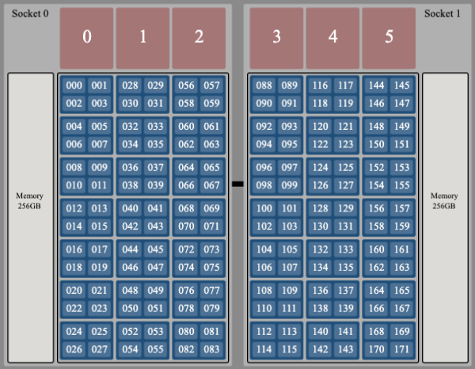

# Explicit Resource File (ERF) CPU Indexing

`jsrun`'s Explicit Resource File, or ERF, provides users with a great amount of
control over how their jobs are placed on Summit's compute nodes. In
particular, it allows the ability to place specific MPI ranks on specific
physical hardware. There are a few options with the ERF that can control this
layout, and they can sometimes be a source of confusion. In this tutorial,
we'll explain these options and how they interact.

<hr>

**Note:** This tutorial covers just of one feature of ERFs, CPU indexing. ERFs
support a variety of other options described fully in the [IBM LSF Job Step
Manager
Documentation](https://www.ibm.com/support/knowledgecenter/en/SSWRJV_10.1.0/jsm/10.3/base/erf_format.html). 

<hr>

## Service Core Isolation

To understand the layout options we'll discuss, it's important to first recall
the hardware of a Summit compute node. 

<p align=center>

</p>

This graphic is simplified to represent a user's perspective of Summit's AC922
compute nodes. Importantly, note that each Power9 processor actually has 22
cores, not 21 as shown in this image. The 22nd core is intentionally reserved
to hold system services, and is not available to end-user applications. This
core isolation helps to reduce jitter in your application's execution. Knowing
that a 22nd core exists on each Power9 CPU is critical to fully understanding
how resources specified in an ERF will map onto the physical node.

## `cpu_index_using`

ERF files can optionally contain a preamble of symbols (see [IBM
Documentation](https://www.ibm.com/support/knowledgecenter/en/SSWRJV_10.1.0/jsm/10.3/base/erf_format.html)
for full list of symbols) that define options for the entire job step. This
preamble can specify behavior such as allowing or disallowing CPU
oversubscription, GPU oversubscription, overlapping resource sets, among
others. This tutorial will focus on the `cpu_index_using` symbol, which accepts
values of `logical` or `physical`. We'll first discuss `physical`.

### Physical Indexing

Physical indexing is far easier to conceptualize than logical indexing, so
we'll start with it. As pictured above, each of the physical cores on a Power9
CPU can support 4 hardware threads. Notice that those hardware threads are
numbered 0 - 83 on the first socket, and 88 - 171 on the second socket. As you
may have guessed, hardware threads 84 - 87 and 172 - 175 exist on the isolated
service cores for each socket, and are not depicted here.

When using physical indexing, the numbers you assign as values to `cpu:` in
your ERF directly correspond to these hardware thread numbers. That's why
physical indexing is much easier to understand, and you'll probably want to use
it if you're looking for fine-grained control over process placement.

There's one caveat, though. You must consider the simultaneous multithreading
(SMT) level setting of your job. If running under SMT4 (which is the system
default on Summit), there are no additional considerations. However, if you've
requested SMT1 or SMT2, you will be restricted in which numbers you can use as
a value to `cpu:`. For SMT1, you can only use the "first" hardware thread on
each core (ex. 0, 4, 8, 12, ...). For SMT2, you can only use the "first two"
hardware threads on each fore (ex. 0, 1, 4, 5, 8, 8, ...).

To use physical indexing in your ERF, set the following in its preamble:
```
cpu_index_using: physical
```

### Logical Indexing

The other way of indexing cores is `logical`, which has more potential to cause
confusion, but it does have some benefits. In logical indexing, the available
values for `cpu:` are not interrupted by the isolated service core on each
socket, or by your choice of SMT mode. You don't have to worry about which
hardware threads need to be skipped. For the default SMT4, the available range
is from 0 - 167. For SMT2, it is 0 - 83. For SMT1 it is 0 - 41.

The complexity of logical indexing comes in mapping the `cpu:` values to the
physical cores.

#### SMT4

The simplest variant is logical indexing with SMT4. The numbering of hardware
threads on the first socket is the same as it was with physical indexing. That
doesn't hold for the second socket. Recall that with logical indexing, the
`cpu:` values are a continuous range of numbers. Considering this, the first
hardware thread on the second socket is 84, not 88 like it was with physical
indexing. This means that under SMT4, the logical index for hardware threads on
the second socket is 4 less than the physical index.

#### SMT1

Now let's discuss SMT1 with logical indexing. We'll discuss SMT2 last, as it's
a bit more involved. 

Under SMT1, an end-user application is limited to one hardware thread per
physical core. On the first socket, our values range from 0 - 20. If we want to
translate this logical ID to a physical hardware thread, just multiply by 4. On
the second socket, remember that we must account for the isolated service core
when translating a logical index to a physical one. To map a logical index to a
physical core in SMT1 on the second socket, multiply by 4, then add 4.

#### SMT2

When logical indexing with SMT2, remember that only the "first two" hardware
threads on each physical core are usable. However, again, unlike physical
indexing, the valid values to `cpu:` form a continuous range from 0-83. Mapping
the logical indices to physical ones once again depends on whether we're on the
first or second socket, and whether we're considering an even or an odd index
value. For even logical values on the first socket, the physical index is 2n.
For odd ones, it's 2n-1. If we consider the second socket, we simply add 4
(just as we did in the SMT1). This means logical index n corresponds to
physical index 2n+4 for even logical indices and 2n+3 for odd ones.


To use logical indexing in your ERF, set the following in its preamble:
```
cpu_index_using: logical
```

The tables below summarize the mapping for various SMT values.

**Convert logical index n to physical index (hardware thread)**

|          | SMT1   | SMT2                                        | SMT4  |
|----------|--------|---------------------------------------------|-------|
| Socket 0 | 4n     | 2n (for even n) <br> 2n - 1 (for odd n)     | n     |
| Socket 1 | 4n + 4 | 2n + 4 (for even n) <br> 2n - 3 (for odd n) | n + 4 |


**Convert physical index (hardware thread) n to logical index**

|          | SMT1 <br> (only valid if n%4 is 0) | SMT2 <br> (only valid if n%4 < 2) | SMT4 |
|----------|------------------------------------|------------------------------|------|
| Socket 0 | ⌊n/4⌋                              | ⌈n/2⌉                        | n    |
| Socket 1 | ⌊(n-4)/4⌋                          | ⌈(n-4)/2⌉                    | n-4  | 
